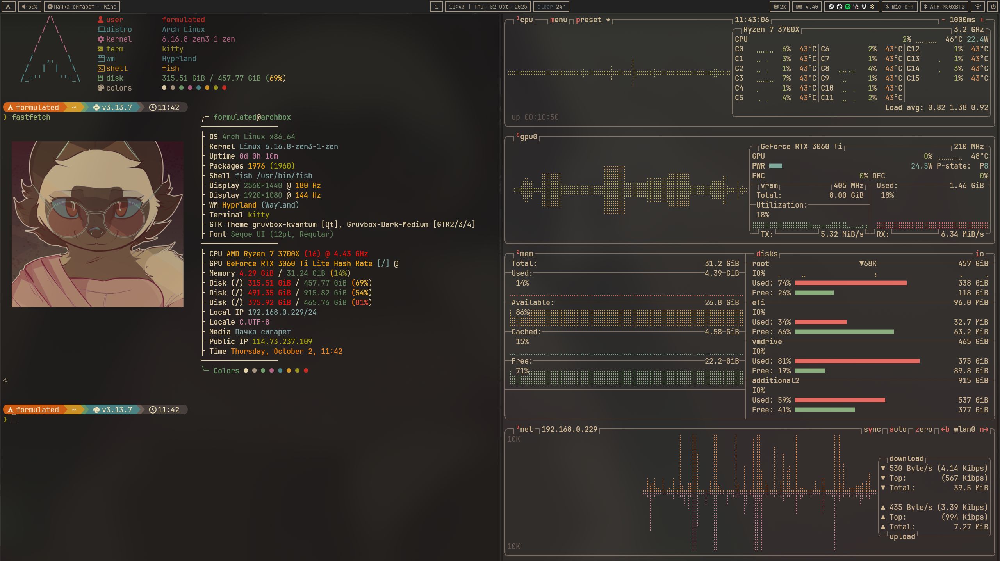
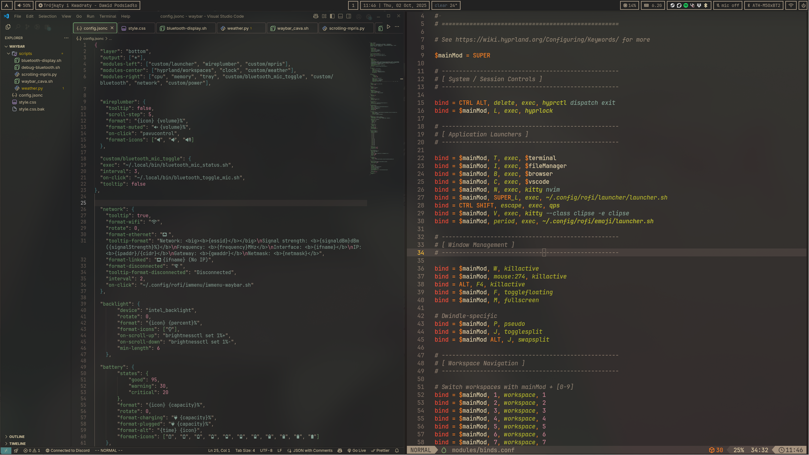

	
	<h1>shid and fard dotfiles</h1>

## um i uh i erm i uhhh i use arch btw

> dotfiles - nobody asked for it but every arch user needs to obnoxiously advertise their dotfiles on every social media so its **tiem to becum true arch user (btw) !!111!!!**  
> probably around 60% of these files are stolen and will NOT be credited

---

## screenshots

	
	

## index

**Configs:** [hypr](https://github.com/formulated0/dotfiles/tree/main/hypr) | [waybar](https://github.com/formulated0/dotfiles/tree/main/waybar) | [kitty](https://github.com/formulated0/dotfiles/tree/main/kitty) | [fish](https://github.com/formulated0/dotfiles/tree/main/fish) | [nvim](https://github.com/formulated0/dotfiles/tree/main/nvim) | [yazi](https://github.com/formulated0/dotfiles/tree/main/yazi) | [rofi](https://github.com/formulated0/dotfiles/tree/main/rofi) | [mako](https://github.com/formulated0/dotfiles/tree/main/mako) | [btop](https://github.com/formulated0/dotfiles/tree/main/btop) | [fastfetch](https://github.com/formulated0/dotfiles/tree/main/fastfetch) | [Kvantum](https://github.com/formulated0/dotfiles/tree/main/Kvantum) | [qt5ct](https://github.com/formulated0/dotfiles/tree/main/qt5ct) | [qt6ct](https://github.com/formulated0/dotfiles/tree/main/qt6ct) | [starship](https://github.com/formulated0/dotfiles/tree/main/starship) | [misc scripts](https://github.com/formulated0/dotfiles/tree/main/.local/bin)

---

## sysinfo

| Key | Value |
|-----|-------|
| distro | arch linux (btw) |
| kernel | 6.16.8-zen3-1-zen (as of 02/10/25) |
| wm | hyprland |
| statusbar | waybar |
| term | kitty |
| shell | fish |
| editor | vsc (with vim extension) |
| editor2 | neovim (lazyvim) |
| fm | dolphin/yazi |
| launcher | rofi |
| notification daemon | mako |

---

## hardware

| Component | Spec |
|-----------|------|
| cpu | ryzen 7 3700x |
| gpu | nvidia rtx3060ti |
| memory | 32gb ddr4 |
| mb | gigabyte b550m ds3h |

---
